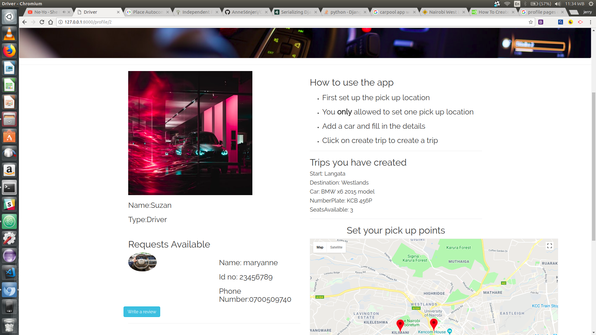

## CarPool
An app bulid using Django a python framework  

- Home page

- Driver Profile Page

- Directions map

## Author name
Maryanne  Njeri

## Project Description

- Carpool is an app that enables both the driver and the passengers to interact the driver sets up a pick up location and fills in the car and the trip details they are also able to view requests made by the passengers
- Passengers can login to the application and request a trip they can also search for pickup points available and also get the directions from where they are to the pick up point

## Project setup instructions:
- Install Django1.11 and Python 3.6

- Git clone repo then you will need to install venv that is a  virtual enviroment and run source virtual/bin/activate
- Then pip freeze > requirements.txt

- open http://127.0.0.1:8000/ on your browser to view on the localhost

- To watch a live demo of the app click the link below
https://www.youtube.com/watch?v=eP_y8SpS3KA&feature=youtu.be

## Technology used:
- Python3.6
- Django
- Bootstrap 3
- HTML5/CSS
- postgresql
- Google Maps Javascript api
- Javascript

## Copyright and License information:
Her  project is licenced under the MIT License.

Permission is hereby granted, free of charge, to any person obtaining a copy of this software and associated documentation files (the "Software"), to deal in the Software without restriction, including without limitation the rights to use, copy, modify, merge, publish, distribute, sublicense, and/or sell copies of the Software, and to permit persons to whom the Software is furnished to do so, subject to the following conditions:

The above copyright notice and this permission notice shall be included in all copies or substantial portions of the Software.

THE SOFTWARE IS PROVIDED "AS IS", WITHOUT WARRANTY OF ANY KIND, EXPRESS OR IMPLIED, INCLUDING BUT NOT LIMITED TO THE WARRANTIES OF MERCHANTABILITY, FITNESS FOR A PARTICULAR PURPOSE AND NONINFRINGEMENT. IN NO EVENT SHALL THE AUTHORS OR COPYRIGHT HOLDERS BE LIABLE FOR ANY CLAIM, DAMAGES OR OTHER LIABILITY, WHETHER IN AN ACTION OF CONTRACT, TORT OR OTHERWISE, ARISING FROM, OUT OF OR IN CONNECTION WITH THE SOFTWARE OR THE USE OR OTHER DEALINGS IN THE SOFTWARE.* CopyRight(c) 2017 MaryAnneNjeri
